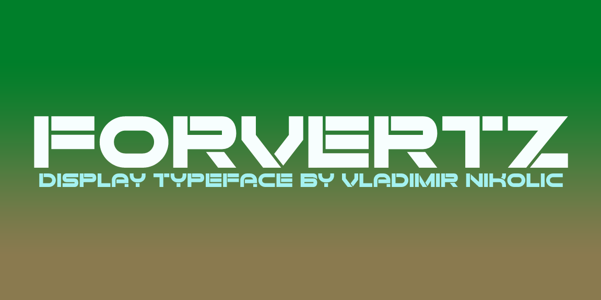
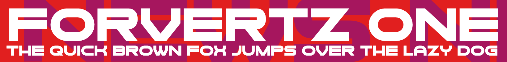
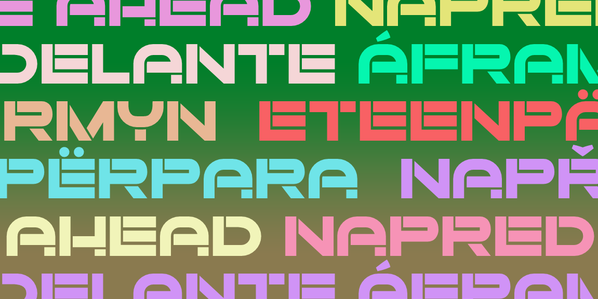

# Forvertz

The Forward (Yiddish: פֿאָרווערטס, romanized: Forverts), formerly known as The Jewish Daily Forward, is an American news media organization for a Jewish American audience.

## Variable Font Axe

Forvertz has the following axe:

Axis | Tag | Default | Static Instances
--- | --- | --- | ---
Weight | wght | 400 | Regular

This Font Software is licensed under the SIL Open Font License, Version 1.1.
This license is available with a FAQ at [https://openfontlicense.org](https://openfontlicense.org)
